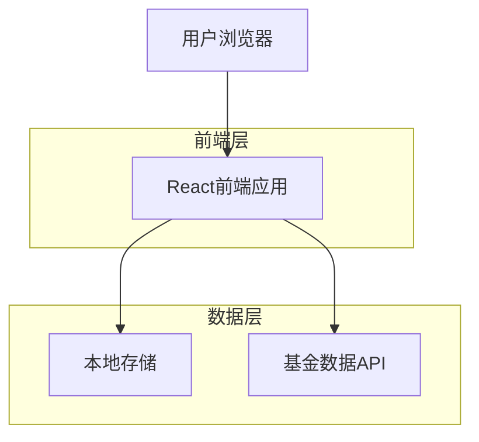

## 1. 架构设计



## 2. 技术描述

- **前端**: React@18 + Vite + TailwindCSS
- **初始化工具**: create-vite (React模板)
- **状态管理**: React Context + useReducer
- **本地存储**: localStorage + IndexedDB
- **UI组件**: 自定义组件 + TailwindCSS
- **图表展示**: 轻量级图表库（如Chart.js）
- **后端**: 无（纯前端应用，直接调用第三方API）

## 3. 路由定义

| 路由 | 用途 |
|------|------|
| / | 首页，显示基金列表和实时估值 |
| /settings | 设置页面，配置刷新频率和缓存管理 |

## 4. 数据模型

### 4.1 基金数据模型
```typescript
interface Fund {
  code: string;          // 基金代码
  name: string;          // 基金名称
  currentValue: number;  // 当前估值
  previousValue: number; // 上一个估值
  change: number;        // 涨跌金额
  changePercent: number; // 涨跌百分比
  updateTime: string;    // 更新时间
}

interface FundCache {
  funds: Fund[];
  lastUpdate: string;
  cacheExpiry: number;
}
```

### 4.2 应用状态模型
```typescript
interface AppState {
  funds: Fund[];
  isLoading: boolean;
  error: string | null;
  refreshInterval: number; // 毫秒
  lastRefreshTime: string;
}
```

## 5. 核心功能实现

### 5.1 数据获取流程
1. 用户添加基金代码
2. 验证基金代码格式（6位数字）
3. 调用基金数据API获取实时估值
4. 解析返回数据，提取关键信息
5. 更新本地状态并持久化存储

### 5.2 自动刷新机制
- 使用setInterval定时器实现自动刷新
- 可配置的刷新间隔（默认1分钟）
- 页面可见性变化时智能刷新
- 错误重试机制（最多3次）

### 5.3 本地存储策略
- localStorage：存储基金代码列表、用户设置
- IndexedDB：存储基金详细数据、历史记录
- 内存缓存：当前会话的基金数据
- 缓存过期机制：避免过期数据展示

## 6. 第三方API集成

### 6.1 基金数据源
- 使用公开的基金估值API（如天天基金、好买基金等）
- API请求频率限制处理
- 数据格式统一化处理
- 错误处理和降级策略

### 6.2 API调用示例
```typescript
// 获取基金估值
async function getFundValue(fundCode: string): Promise<Fund> {
  try {
    const response = await fetch(`/api/fund/${fundCode}`);
    const data = await response.json();
    return {
      code: fundCode,
      name: data.name,
      currentValue: data.currentValue,
      previousValue: data.previousValue,
      change: data.change,
      changePercent: data.changePercent,
      updateTime: new Date().toISOString()
    };
  } catch (error) {
    throw new Error(`Failed to fetch fund data: ${error}`);
  }
}
```

## 7. 错误处理

### 7.1 网络错误
- API请求超时处理（5秒超时）
- 网络断开时的离线模式
- 错误信息的友好展示
- 重试机制的指数退避

### 7.2 数据错误
- 基金代码不存在提示
- 数据格式异常处理
- 空数据状态的展示
- 数据过期检测

## 8. 性能优化

### 8.1 前端优化
- React组件懒加载
- 虚拟滚动处理大量基金数据
- 防抖处理频繁的用户操作
- 图片和资源的懒加载

### 8.2 数据优化
- API请求去重
- 数据缓存策略
- 增量更新机制
- 后台数据预加载

## 9. 部署配置

### 9.1 本地部署
- 静态文件部署（无需服务器）
- 支持本地文件访问（file://协议）
- 跨域请求处理方案
- 离线访问支持（Service Worker）

### 9.2 构建配置
```json
{
  "scripts": {
    "dev": "vite",
    "build": "vite build",
    "preview": "vite preview",
    "build:local": "vite build --mode local"
  }
}
```

## 10. 开发依赖

### 10.1 核心依赖
```json
{
  "dependencies": {
    "react": "^18.2.0",
    "react-dom": "^18.2.0",
    "tailwindcss": "^3.3.0"
  },
  "devDependencies": {
    "@vitejs/plugin-react": "^4.0.0",
    "vite": "^4.4.0",
    "typescript": "^5.0.0"
  }
}
```