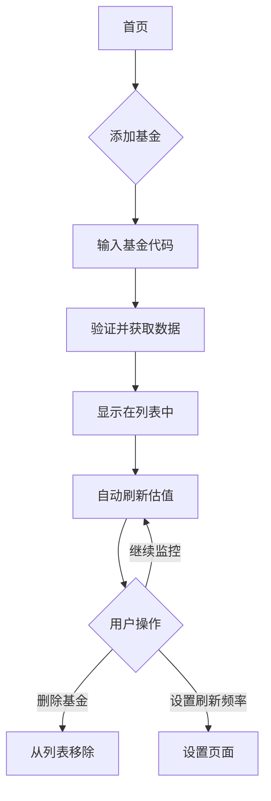

## 1. 产品概述
基金实时估值项目是一个本地部署的Web应用，允许用户通过基金代码添加关注的基金，并实时显示基金的盘中估值数据。该应用帮助投资者及时了解基金净值变化，做出投资决策。

目标用户为个人投资者，通过简洁的界面快速查看基金估值，无需登录即可使用。

## 2. 核心功能

### 2.1 用户角色
本产品为单用户本地应用，无需用户注册和登录系统。

### 2.2 功能模块
基金实时估值项目包含以下主要页面：
1. **首页**：基金列表展示、添加基金、删除基金、实时估值显示。
2. **设置页面**：刷新频率设置、数据缓存管理。

### 2.3 页面详情
| 页面名称 | 模块名称 | 功能描述 |
|---------|---------|---------|
| 首页 | 基金列表 | 显示已添加的基金代码、名称、当前估值、估值涨跌、更新时间 |
| 首页 | 添加基金 | 输入基金代码，点击添加按钮，验证基金代码有效性 |
| 首页 | 删除基金 | 每个基金项提供删除按钮，点击后移除该基金 |
| 首页 | 实时估值 | 自动刷新显示最新估值数据，显示估值时间和涨跌百分比 |
| 设置页面 | 刷新频率 | 设置自动刷新间隔（30秒/1分钟/5分钟） |
| 设置页面 | 数据缓存 | 显示本地缓存状态，提供清除缓存功能 |

## 3. 核心流程
用户使用流程：
1. 用户首次访问首页，看到空白的基金列表
2. 点击"添加基金"按钮，输入基金代码
3. 系统验证基金代码并获取基金信息
4. 基金添加到列表中，开始显示实时估值
5. 系统自动定时刷新估值数据
6. 用户可随时删除不需要的基金

## 4. 用户界面设计

### 4.1 设计风格
- **主色调**：绿色（#10B981）表示上涨，红色（#EF4444）表示下跌
- **辅助色**：灰色（#6B7280）用于中性信息
- **按钮样式**：圆角矩形，悬停效果
- **字体**：系统默认字体，主要信息14-16px
- **布局**：卡片式布局，每行显示一个基金信息
- **图标**：使用简洁的线性图标表示操作按钮

### 4.2 页面设计概述
| 页面名称 | 模块名称 | UI元素 |
|---------|---------|---------|
| 首页 | 基金列表 | 卡片式布局，每个基金显示代码、名称、估值、涨跌幅，使用颜色区分涨跌 |
| 首页 | 添加基金 | 顶部搜索框，输入基金代码，添加按钮 |
| 首页 | 操作按钮 | 删除按钮使用红色图标，设置按钮在右上角 |
| 设置页面 | 刷新设置 | 单选按钮组选择刷新频率 |
| 设置页面 | 缓存管理 | 显示缓存大小，清除按钮 |

### 4.3 响应式设计
采用桌面优先设计，适配不同屏幕尺寸：
- 桌面端：横向布局，每行显示完整基金信息
- 平板端：保持相似布局，适当调整间距
- 移动端：垂直堆叠，重要信息优先显示

### 4.4 数据展示优化
- 估值数据保留4位小数
- 涨跌幅显示百分比，保留2位小数
- 时间显示采用相对时间（如"刚刚"、"1分钟前"）
- 加载状态显示骨架屏，错误状态显示友好提示